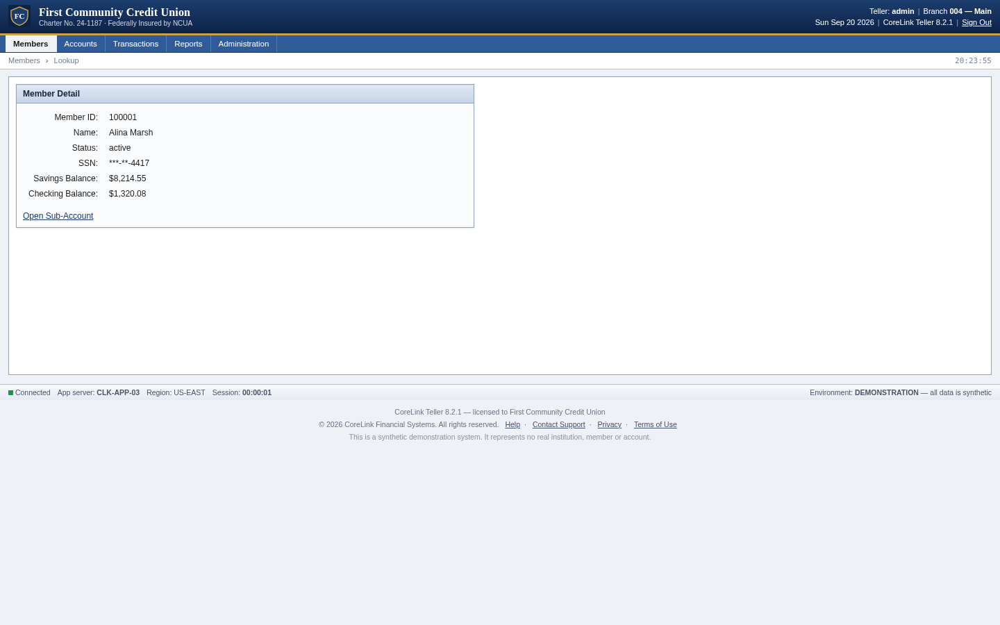
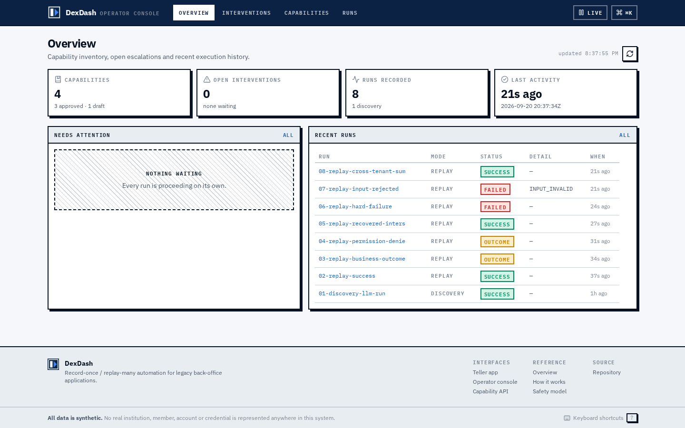
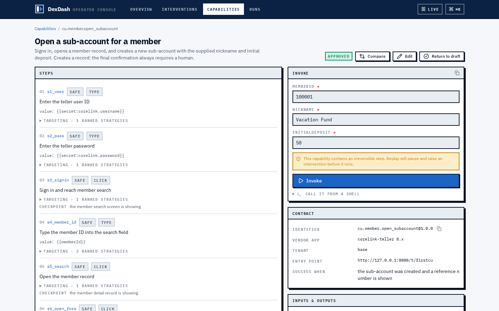
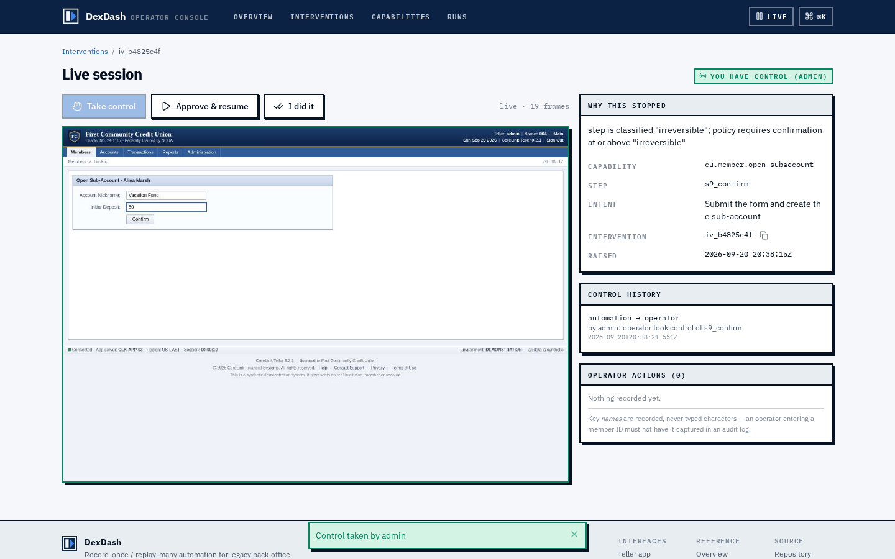
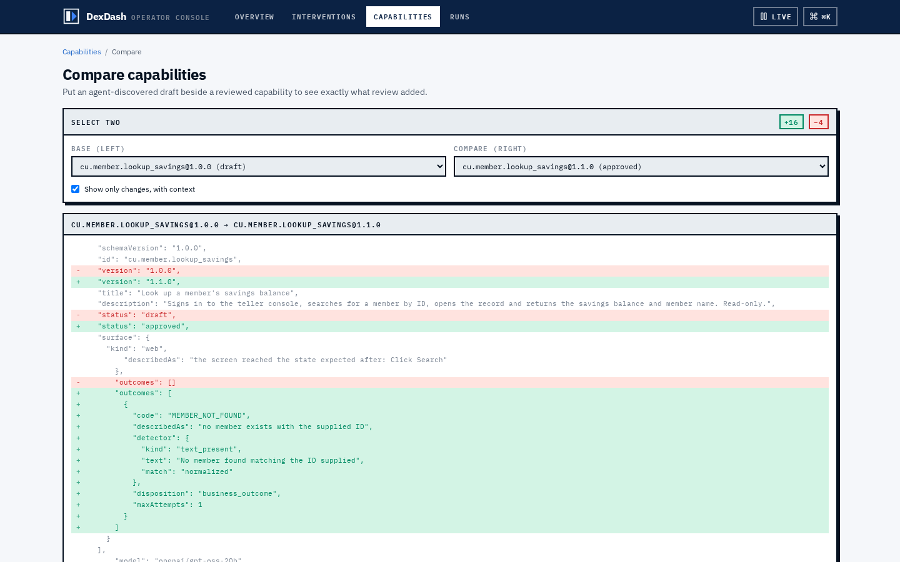
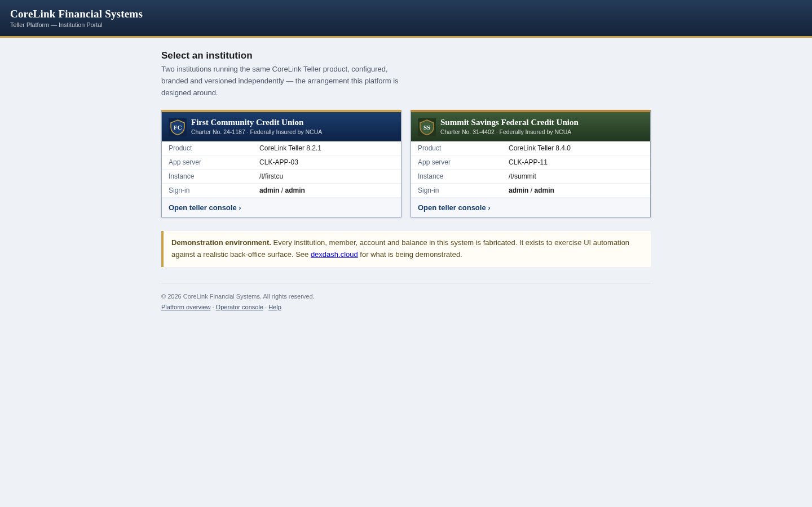

# computer-use-automation

**Record-once / replay-many UI automation for legacy back-office applications.**

An LLM drives a real application surface to accomplish a goal the first time. The
successful run is recorded as a typed, versioned **capability artifact**. That artifact is
then replayed deterministically, with no model in the decision loop — which is how a
calling agent invokes it in production.

> The model discovers · the artifact becomes a reusable capability · deterministic replay is how it gets used.

The design write-up is **[REPORT.md](REPORT.md)**. **[DECISIONS.md](DECISIONS.md)** is the
running log of why each choice was made, including the bugs that produced several of them.

> **Everything here is synthetic.** The target application is a stand-in built for this
> project. No real institution, member, account or credential is represented anywhere in
> the code, fixtures or evidence.

---

## Where each requirement is met

Every row is something you can click or run. Credentials are `admin` / `admin` throughout.

| # | Requirement (from the brief) | How it is met | Code | Exercise it |
|---|---|---|---|---|
| **3.1** | **Goal-driven agent loop** — accept a goal + target, run observe→decide→act against a live surface until the goal or a stopping condition | LLM tool-calling loop over a CDP accessibility snapshot. Every tool call is Zod-validated and policy-checked *before* it touches the browser. Stops on `done`, `blocked`, max steps, or a refused action. | [`src/agent/loop.ts`](src/agent/loop.ts) · [`tools.ts`](src/agent/tools.ts) · [`llm.ts`](src/agent/llm.ts) | `npm run discover` · or the console at **[/capabilities/new](https://console.dexdash.cloud/capabilities/new)** |
| **3.1** | Must drive a **real UI**, and work without a clean DOM | Perception is the accessibility tree over CDP (`Accessibility.getFullAXTree`), never CSS. The target app's login fields have **no accessible name at all** — they resolve only by adjacent-cell inference. | [`src/surface/web.ts`](src/surface/web.ts) · [`types.ts`](src/surface/types.ts) | **[teller.dexdash.cloud](https://teller.dexdash.cloud)** — view source: frameset, tables, `ctl00$MainContent$…`, no test IDs |
| **3.2** | **Structured artifact** — ordered steps, how each control is identified, typed inputs/outputs, a checkpoint | A capability is a *contract*: inputs and outputs with per-field sensitivity, ranked locator strategies each carrying a confidence and written rationale, per-step checkpoints, a declared outcome table, a policy block, and provenance holding a transcript **hash** rather than the transcript. | [`src/core/artifact.ts`](src/core/artifact.ts) · [`targeting.ts`](src/core/targeting.ts) · [`assertions.ts`](src/core/assertions.ts) | **[Capability detail](https://console.dexdash.cloud/capabilities/cu.member.open_subaccount@1.0.0)** — expand any step's *targeting* · [`artifacts/`](artifacts/) |
| **3.2** | Versioned and **reviewable** | Semver per artifact; the console renders steps, ranked strategies, the outcome table and the policy so a human can review without reading JSON. Editing is schema-validated. | [`web/src/console/pages/CapabilityDetail.tsx`](web/src/console/pages/CapabilityDetail.tsx) | **[/capabilities](https://console.dexdash.cloud/capabilities)** → *Edit* / *Approve* |
| **3.3** | **Deterministic replay** without the LLM | Replay reads only the artifact. Strategies are tried in recorded order; the first *unambiguous* resolution wins. Resolution is a pure function of (descriptor, observation), so it is unit-testable without a browser. | [`src/replay/executor.ts`](src/replay/executor.ts) · [`src/surface/resolve.ts`](src/surface/resolve.ts) | `npx tsx src/cli/index.ts replay cu.member.read_savings_balance --input memberId=100001` |
| **3.3** | **Stable targeting** | Ranked: scoped role+name → normalized/aliased → label-proximity → nth-of-role. CSS/XPath are supported by the schema but **never emitted**. Ambiguity is a halt, not a tiebreak. | [`src/surface/resolve.ts`](src/surface/resolve.ts) · [`tests/resolve.test.ts`](tests/resolve.test.ts) | `npm test` — 13 resolver tests |
| **3.3** | **Business outcome vs. recoverable vs. hard failure** | `BusinessOutcome` is a plain type, not an `Error` — the conflation is unrepresentable. Outcome detectors are polled *together with* checkpoints, so a legitimate answer is never reported as a crash. CLI exit codes carry it: outcome → 0, failure → 1. | [`src/core/errors.ts`](src/core/errors.ts) · [`src/replay/outcomes.ts`](src/replay/outcomes.ts) | `npx tsx scripts/replay-matrix.ts` — all seven states |
| **3.4** | **Allowlist**, enforced | Checked before *every* action, and again at the network layer via route interception, so a page-initiated redirect cannot carry the session off-list. Literal-match language, not regex, so a reviewer can read it. | [`src/core/policy.ts`](src/core/policy.ts) | [`tests/policy.test.ts`](tests/policy.test.ts) — includes prefix-confusion and host-suffix attacks |
| **3.4** | **Risky / irreversible actions** | Classified at *record* time and reviewable before approval, so replay can only ever run steps already vetted. Steps at or above `confirmAtOrAbove` stop and ask a human every time. Discovery gates the same way, using the same heuristic. | [`policy.ts`](src/core/policy.ts) `classifyActionRisk` | **[Capability detail](https://console.dexdash.cloud/capabilities/cu.member.open_subaccount@1.0.0)** → *Invoke* (pauses at `s9_confirm`) |
| **3.4** | **Never persist secrets or PII** | Redaction runs on the **write path** inside the logger, so a call site that forgets is still safe. Two mechanisms: registered values and structural patterns (SSN, Luhn-checked cards, API keys). Screenshots mask sensitive fields at capture time. The model never sees a credential — it emits `{{secret:…}}` and the executor substitutes at typing time. | [`src/core/redact.ts`](src/core/redact.ts) · [`log.ts`](src/core/log.ts) · [`template.ts`](src/core/template.ts) | `grep -r "demo-teller-pw" evidence/` → nothing |
| **3.5** | **Evidence / observability** | Structured JSONL per run: every action, policy verdict, locator resolution *with the strategy index actually used*, checkpoint and outcome. Screenshots and accessibility snapshots on failure. | [`src/core/log.ts`](src/core/log.ts) · [`src/server/runs.ts`](src/server/runs.ts) | **[/runs](https://console.dexdash.cloud/runs)** — press `n` to jump between notable events · [`evidence/`](evidence/) |
| **3.6** | **Detect stuck and route it** | Not heuristic: the union of a `confirm` policy verdict, an escalate-disposition outcome, and exhausted recovery. The request carries capability, step, reason, live URL and a screenshot. | [`src/server/interventions.ts`](src/server/interventions.ts) | **[/interventions](https://console.dexdash.cloud/interventions)** |
| **3.6** | **Take control of the live session**, then hand back | A control lease with one holder. Automation **parks** rather than dying — the pause is an un-awaited promise, so the browser context, cookies and position survive. The operator drives the same session over CDP `Page.startScreencast` + `Input.dispatch*`, through the same input path the automation uses. | [`src/server/lease.ts`](src/server/lease.ts) · [`index.ts`](src/server/index.ts) · [`SessionView.tsx`](web/src/console/pages/SessionView.tsx) | `npx tsx scripts/demo-handoff.ts` — includes the server **refusing** operator input before control is taken |
| **3.7** | **Surface abstraction** (design) | Nothing above `src/surface/types.ts` imports Playwright or CDP. `SurfaceNode` is role/name/value — the same model UIA and AX expose. Remote control is a separate `RemoteControllable` capability, so a surface that cannot be screencast degrades honestly. | [`src/surface/types.ts`](src/surface/types.ts) | REPORT §4 |
| **3.7** | **Multi-tenant reuse** | A capability binds to the *vendor product*, not a tenant. Ranked strategies absorb label differences; `tenantOverrides` carries only what a base recording cannot know. **Demonstrated**, not argued. | [`artifact.ts`](src/core/artifact.ts) `specializeForTenant` | `npx tsx src/cli/index.ts replay cu.member.read_savings_balance --input memberId=100001 --tenant summit` |
| **8** | *Stretch:* agent-invocable capability catalog | Artifacts exposed as callable tools with JSON Schema generated from the same `ParamSpec` replay validates against — one source of truth, two consumers. Only `approved` capabilities are offered. | [`src/server/catalog.ts`](src/server/catalog.ts) | `curl -u admin:admin https://api.dexdash.cloud/api/capabilities/tools` |
| **8** | *Stretch:* confidence & approval gate | `draft → approved`, enforced before a browser launches. A discovered capability is *always* a draft. | [`policy.ts`](src/core/policy.ts) `checkApproval` | Invoke a draft unattended → `NOT_APPROVED` |
| **8** | *Stretch:* cross-tenant reuse with per-variant overrides | One artifact, two institutions, different labels and an extra interstitial. The run log shows which tenant needed a fallback strategy. | [`artifact.ts`](src/core/artifact.ts) | [`evidence/08-replay-cross-tenant-summit/`](evidence/) |

---

## Live demo

| | | |
|---|---|---|
| **[dexdash.cloud](https://dexdash.cloud)** | What the system is and how the surfaces fit together | open |
| **[teller.dexdash.cloud](https://teller.dexdash.cloud)** | CoreLink Teller — the synthetic application the agent drives | open · `admin`/`admin` |
| **[console.dexdash.cloud](https://console.dexdash.cloud)** | Operator console — escalations, live takeover, catalog, evidence, authoring | `admin`/`admin` |
| **[api.dexdash.cloud](https://api.dexdash.cloud/api/capabilities)** | Capability API — saved flows as callable tools | `admin`/`admin` |

The console and API are authenticated because the console can take control of a live
browser session; an unauthenticated remote-control endpoint on a public hostname is a real
hole, not a theoretical one. The teller app is open — its data is entirely fabricated.

---

## Screenshots

| The target application | The operator console |
|---|---|
|  |  |
| A synthetic credit-union back-office: frameset, table layout, generated control names, no test IDs. Its login fields have no accessible name at all. | Capability inventory, open escalations and recent execution history. |

| Capability contract | Live handoff |
|---|---|
|  |  |
| Steps with risk class, expandable ranked targeting strategies, the declared outcome table, and an invoke form generated from the input schema. | An operator holding the control lease on a genuinely paused run, streamed over CDP. Automation is parked at the irreversible step. |

| What review contributes | Institution portal |
|---|---|
|  |  |
| `@1.0.0` is exactly what the model emitted (draft, no outcomes); `@1.1.0` is the same flow after a human added the outcome table. | Two institutions running the same vendor product, branded and versioned independently. |

More in [`docs/screenshots/`](docs/screenshots/) — regenerate with `node scripts/capture-docs.mjs`.

---

## Setup

```bash
npm install
npx playwright install chromium
cp .env.example .env     # add NVIDIA_API_KEY for discovery only
```

**Node 22+.** An NVIDIA NIM API key is needed *only* for discovery. Replay never calls a
model and the target app is local, so **the entire replay path runs with no key and no
network access.**

## Demo path

```bash
npm run target      # the synthetic application    → 127.0.0.1:8080
npm run serve       # capability API + console     → 127.0.0.1:4000
npm run dev         # both, plus the Vite dev server
```

```bash
# 1. an LLM-driven discovery run (needs NVIDIA_API_KEY)
npm run discover
#   → artifacts/cu.member.lookup_savings@1.0.0.json   (status: draft)

# 2. deterministic replay — no model involved
npx tsx src/cli/index.ts replay cu.member.read_savings_balance --input memberId=100001
#   {"status":"success","outputs":{"savingsBalance":8214.55,...}}

npx tsx src/cli/index.ts replay cu.member.read_savings_balance --input memberId=999999
#   {"status":"outcome","outcome":{"code":"MEMBER_NOT_FOUND",...}}   exits 0 — not a failure

npx tsx src/cli/index.ts replay cu.member.read_savings_balance --input memberId=200004
#   {"status":"failed","failure":{"code":"APP_ERROR",...}}           exits 1

# 3. the same artifact against a second institution
npx tsx src/cli/index.ts replay cu.member.read_savings_balance \
  --input memberId=100001 --tenant summit

# 4. human-in-the-loop handoff, end to end
npx tsx scripts/demo-handoff.ts
```

```bash
npm test             # 72 unit tests
npm run typecheck
npm run evidence     # regenerate /evidence/
npm run visual       # screenshot + console-error + overflow sweep, 50 combinations
```

### Teaching and reviewing capabilities

The console is where the draft → approved gate is actually passed:

- **Teach new** (`/capabilities/new`) runs discovery against a goal you type and saves a
  draft. Discovery has its own allowlist, separate from console auth — aiming an
  LLM-driven browser at an arbitrary URL is a distinct privilege.
- **Edit** opens the JSON, validated on save against the schema replay parses with. Bump
  `version` to write a new artifact instead of overwriting one in production.
- **Approve** flips a reviewed draft to `approved`. Reversible.
- **Compare** diffs two capabilities.

The loop in one line: the agent's draft returned `CHECKPOINT_FAILED` for a missing member;
a reviewer added one outcome rule and it returns `MEMBER_NOT_FOUND`; approved, it runs
unattended and appears in the callable tool catalog.

---

## The target application

"CoreLink Teller" — deliberately built as a *hostile* automation surface: an iframe shell,
table-based layout, ASP.NET-style generated control names (`ctl00$MainContent$txtMemberId`),
no test IDs, and no `<label for>` anywhere. Measured against it, **the login fields have no
accessible name at all**; a system built only on role+name could not sign in.

It is also *complete* — branded chrome, working navigation across Members, Accounts,
Transactions, Reports and Administration, a session clock, recently-viewed members and
sign-out. Visual realism and machine hostility are independent axes.

Two tenants run the **same vendor product**:

| | `/t/firstcu` | `/t/summit` |
|---|---|---|
| Institution | First Community CU | Summit Savings Federal CU |
| Version | CoreLink 8.2.1 | CoreLink 8.4.0 |
| ID field label | "Member ID" | "Member Number" |
| Search button | "Search" | "Find" |
| Savings label | "Savings Balance" | "Regular Savings" |
| After login | straight to search | acknowledgement screen first |

### Reproducible states

Exceptional states are addressed by member ID, so the evidence shows genuine detection
rather than an injected mock:

| Input | State | Class |
|---|---|---|
| `100001` `100002` `100003` | normal record | success |
| `999999` | no such member | **business outcome** |
| `200001` | permission denied | **business outcome** |
| `200002` | unexpected verification interstitial | **recoverable** |
| `200003` | slow load (~6s) | **recoverable** |
| `200004` | application error, HTTP 500 | **hard failure** |
| `12345` | malformed input | hard failure, before a browser launches |
| — | session expiry (`DEX_SESSION_TTL_MS=1000`) | recoverable (re-auth) |

---

## Layout

```
src/core/      capability schema, error taxonomy, policy, redaction, run log
src/surface/   Surface interface + CDP perception adapter   ← the portability seam
src/agent/     discovery loop, NIM client, capability recorder
src/replay/    executor, locator resolver, outcome detection
src/server/    control lease, escalation registry, catalog, authoring
src/cli/       discover | replay | catalog | serve
web/           operator console + public site (two Vite entries, one design system)
target-app/    the synthetic legacy surface
artifacts/     saved capabilities
evidence/      run logs, screenshots, accessibility snapshots
deploy/        nginx vhosts and systemd units
scripts/       authoring, evidence generation, visual sweep, screenshots
```

Nothing above `src/surface/types.ts` imports Playwright or CDP. That is the seam a desktop
adapter would implement.

## Configuration

| Variable | Purpose |
|---|---|
| `NVIDIA_API_KEY` | discovery only; replay needs no key |
| `DEX_MODEL` | default `openai/gpt-oss-20b` |
| `DEX_RATE_LIMIT_PER_MIN` · `DEX_MIN_REQUEST_SPACING_MS` | provider rate limiting, enforced inside the client |
| `DEX_DISCOVERY_ALLOWED_ORIGINS` | where console-initiated discovery may be aimed |
| `DEX_ESCALATION_TIMEOUT_MS` | how long an unanswered escalation holds a session |
| `DEX_DISCOVERY_TIMEOUT_MS` | wall-clock budget for one discovery run |
| `DEX_TARGET_PORT` · `DEX_OPERATOR_PORT` | default 8080 / 4000 |
| `DEX_TELLER_USER` · `DEX_TELLER_PASS` | target-app credentials, resolved at act time, never logged |

Secrets are referenced in artifacts as `{{secret:corelink.password}}` and substituted at
the moment of typing. The model never sees a credential and no artifact contains one.
